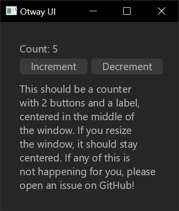

# Otway

### GUI toolkit library which aims to continue the simplicity of Reclutch

## Design Goals

- **Open-ended input/eventing:** There are no restrictions on the types of user input that can be received. You can plug in your own windowing code and emit custom input events (e.g. stylus input), then write custom event handlers which can be attached to widgets. Since it's based on Reclutch, you can also write your own renderer by implementing `GraphicsDisplay`.
- **First-class support for custom widgets:** This is driven by the principle that all the surrounding systems used by the toolkit should also be useful to custom widgets. For example, things like the theming system and input handlers can support custom widgets.
- **Accessibility and replaceability of "under-the-hood" components:** Nothing is "baked in". Not even input handling. If you have a custom solution to widget mouse/keyboard events, handling widget focus, etc. then all of that is easily replaceable. These systems run alongside the widget event handling and are inspired very much by the concept of "systems" in ECS.
- **High-level abstractions:** As nice as complete control over the UI is, it can be tedious. In that regard, it is easy to write abstractions to hide the details and focus on the content. One such abstraction is already provided; `view`.

## Counter Example



```rust
fn counter(parent: ui::CommonRef, aux: &mut Aux) -> View<AppAux, i32> {
    let mut view = View::new(parent, aux, 0);

    let mut vstack = layout::VStack::new().into_node(None);
    let mut hstack = layout::HStack::new().into_node(None);

    let label = view
        .label(aux)
        .layout(&mut vstack, None)
        .size(42.0)
        .into_inner();

    view.button(aux)
        .text("Increment")
        .layout(&mut hstack, None)
        .press(|view, aux, _| {
            view.set_state(|x| *x += 1);
        });

    view.button(aux)
        .text("Decrement")
        .layout(&mut hstack, None)
        .press(|view, aux, _| {
            view.set_state(|x| *x -= 1);
        });

    vstack.push(hstack, None);
    view.set_layout(vstack);

    view.state_changed(move |view| {
        let count = *view.state();
        view.get_mut(label)
            .unwrap()
            .set_text(format!("Count is up to {}", count));
        layout::update_layout(view);
    });

    view.set_state(|_| {});
    view
}
```

The `.button`/`.label` syntax are simply convenience extensions (which can be written for any custom widget). The general, widget-agnostic syntax is like so;

```rust
// A button that is deleted when clicked.
let btn = view.child(Button::new, aux);
view.on(btn, move |view, aux, event: &PressEvent| {
    view.remove(btn);
});
```

## License

Otway is licensed under either

- [Apache 2.0](https://www.apache.org/licenses/LICENSE-2.0)
- [MIT](https://opensource.org/licenses/MIT)

at your choosing.
