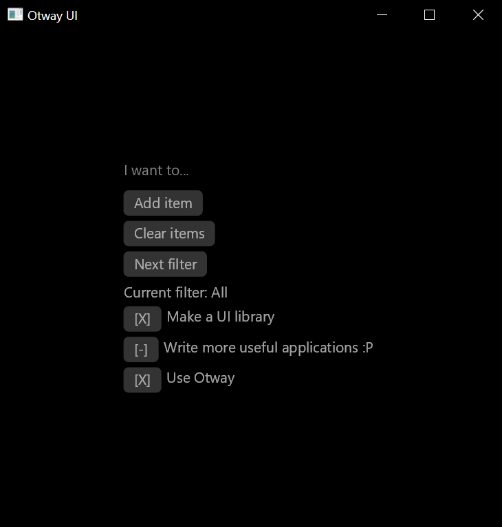

# Otway

### GUI toolkit library which aims to continue the simplicity of Reclutch

## Design Goals

- **Open-ended input/eventing:** There are no restrictions on the types of user input that can be received. You can plug in your own windowing code and emit custom input events (e.g. stylus input), then write custom event handlers which can be attached to widgets. Since it's based on Reclutch, you can also write your own renderer by implementing `GraphicsDisplay`.
- **First-class support for custom widgets:** This is driven by the principle that all the surrounding systems used by the toolkit should also be useful to custom widgets. For example, things like the theming system and input handlers can support custom widgets.
- **Accessibility and replaceability of "under-the-hood" components:** Nothing is "baked in". Not even input handling. If you have a custom solution to widget mouse/keyboard events, handling widget focus, etc. then all of that is easily replaceable. These systems run alongside the widget event handling and are inspired very much by the concept of "systems" in ECS.
- **High-level abstractions:** As nice as complete control over the UI is, it can be tedious. In that regard, it is easy to write abstractions to hide the details and focus on the content. One such abstraction is already provided; `view`.




## ECS-like Components

A lot of logic tends to be shared almost identically across many widgets. For example:

- Mouse Interaction
- Keyboard Interaction
- Widget Focus

What most toolkits do to generalize this across widgets is to simply bake it into the core UI code. However, this results in the UI being locked into a specific functionality, making it difficult to repurpose or customize.

In Otway, these are solved by components. Components simply consist of some data and an event handler. In that way, they resemble the structure of a widget. The difference is that components can be attached to any widget to inflict any functionality.

As an example, we can attach the provided mouse interaction component to any widget we like.

```rust
let mut some_widget = SomeWidget::new(parent, aux);

some_widget.push_component(
    InteractionComponent::new(
        aux,
        |some_widget, _, ev| {
            match ev {
                InteractionEvent::Pressed(_) => {
                    println!("some_widget was clicked on");
                    some_widget.change_color();
                },
                _ => {},
            }
        },
        None,
        None,
    ),
);
```

You can write your own components to introduce custom logic for any widget, foreign or not.

## Event Handling

All the eventing is routed through a single `uniq::rc::Queue`.

`uniq` has support for arbitrary read/write parameters, thus anything can be passed through to event handling code:

```rust
let mut l = aux.listen::<(
    Write<Self>,
    Read<Aux<T>>,
    Write<i32>,
)>().and_on(aux.id, |(this, aux, count), ev: &SomeEvent| {
    // this: &mut Self
    // aux: &Aux<T>
    // count: &mut i32
});

self.listener = l;

// ...

let mut count = 42;

// read from the event queue and dispatch applicable events to the handlers.
ui::dispatch((self, aux, &mut count), |(x, _, _)| &mut x.listener);
```

Since it's all in a single queue, out-of-order events are impossible.
Furthermore, the queue code is abstracted over with closures via `uniq` so that it feels natural to use, just like event handling in any other UI library.

## Layout

The layout API should feel familiar if you've ever used Qt:

```rust
let mut hstack = HStack::new().into_node(/* layout size */ None);

hstack.push(&mut button, /* per-item configuration */ None);
hstack.push(&mut label, None);

let mut vstack = VStack::new().into_node(None);

hstack.push(vstack); // layouts can nest

// hook the layout tree into the widget tree
container.set_layout(hstack);
```

An explicit goal is for the `Layout` trait to be easy to implement in order to make custom layouts as simple as possible.

## View

It's exhausting to deal with `Component` and `Listener` when all you want to do is throw together some buttons in a layout.

`View` is an abstraction aiming to give you that comfort:

```rust
// A simple counter
fn counter<T: 'static>(p: CommonRef, a: &mut Aux<T>) -> View<T, u32> {
    let mut view = View::new(p, a, /* initial state */ 0u32);

    let mut vstack = VStack::new().into_node(None);

    view.button(a) // view mix-in which integrates the toolkit
        .layout(&mut vstack)
        .text("Increment")
        .click(|view, _, _| {
            view.set_state(|x| *x += 1);
        });
    
    let label = view.label(a)
        .layout(&mut vstack)
        .size(/* font size */ 42.0)
        .into_inner();
    
    view.state_changed(move |view| {
        let txt = format!("Count: {}", view.state());
        view.get_mut(label).unwrap().set_text(txt);
    });

    view.set_state(|_| {});

    view
}
```

## Partial View

You may have noticed from the previous example that children of a `View` are accessed by some sort of index: `view.get_mut(label).unwrap()`.

This makes storing children dynamically dead-simple (since you can also do `view.remove(label)`), but what if you precisely know what your children are? In that case, performance and strongly-typed semantics are wasted for no good reason.

A `PartialView` implements `Widget` just like `View`, except it doesn't store children. Instead, you declare a type, implement a specialized version of `WidgetChildren` and `PartialView` will "connect the dots":

```rust
struct Counter<T: 'static> {
    count: u32,

    incr: kit::Button<T>,
    label: kit::Label<T>,
}

impl<T: 'static> ViewPart<T> for Counter<T> {
    fn children(&self) -> Vec<&dyn WidgetChildren<T>> {
        vec![&self.incr, &self.label]
    }
    
    fn children_mut(&mut self) -> Vec<&mut dyn WidgetChildren<T>> {
        vec![&mut self.incr, &mut self.label]
    }
}

fn counter<T: 'static>(p: CommonRef, a: &mut ui::Aux<T>) -> PartialView<T, Counter<T>> {
    let mut view = PartialView::new(p, a, move |p| {
        Counter {
            count: 0,
            incr: kit::Button::new(p, a),
            label: kit::Label::new(p, a),
        }
    });

    let btn_id = view.state().incr.id();

    view.listener_mut()
        .on(btn_id, |(view, _), _: &PressEvent| {
            view.set_state(|x| {
                x.count += 1;
            });
        });

    view.state_changed(|view| {
        let txt = format!("Count: {}", view.state().count);
        view.state_mut().label.set_text(txt);
    });

    view
}
```

We didn't have to implement anything but `ViewPart` since `PartialView` will implement `Element`, `WidgetChildren` and everything else for us.

Notice that now with `ViewPart` we are creating the children directly (though this is possible with `View`) and we can also access them directly (not possible with `View`). This is saved performance, memory, and static typing. The reason why should become clear when you realise that we are avoiding using `HashMap<_, Box<dyn Widget>>` (which is what `View` uses under-the-hood). Of course the trade-off is a somewhat more verbose API.

## License

Otway is licensed under either

- [Apache 2.0](https://www.apache.org/licenses/LICENSE-2.0)
- [MIT](https://opensource.org/licenses/MIT)

at your choosing.
